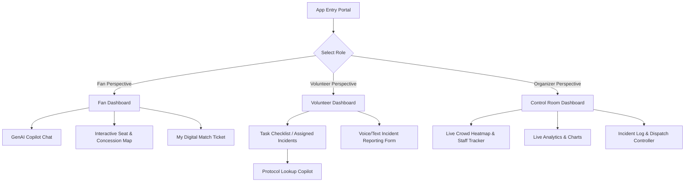
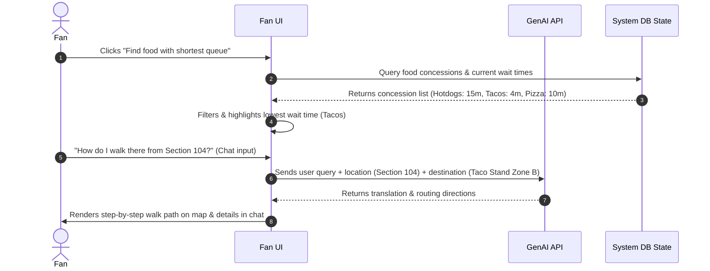
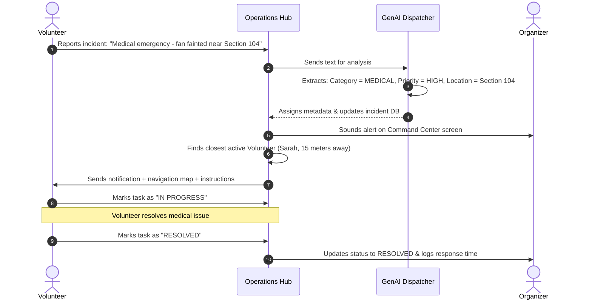

# Webapp Application Flow
## Project Name: ArenaOS — FIFA World Cup 2026 Smart Stadium & Operations Ecosystem

---

## 1. Application Navigation Tree
ArenaOS is designed as a single portal with role-based navigation. A top switcher allows users to view the app as a Fan, Volunteer, or Organizer to simulate the entire ecosystem.

---

## 2. Core User Flows

### 2.1 The Fan Journey (Finding Concessions & Help)

---

### 2.2 Ground Operations Flow (Incident Dispatch Loop)

---

## 3. Dynamic State Changes
The application manages state reactivity across views. When a new incident is submitted:
1.  **Database**: Appends new incident object.
2.  **Organizer Dashboard**: 
    *   Increments "Active Incidents" counter.
    *   Adds a marker on the stadium map (flashing red beacon).
    *   Appends item to "Live Incident Log" with highest priority.
3.  **Volunteer View**: Updates volunteer screen if they are assigned.
4.  **Analytics**: Redraws real-time incident status charts.
