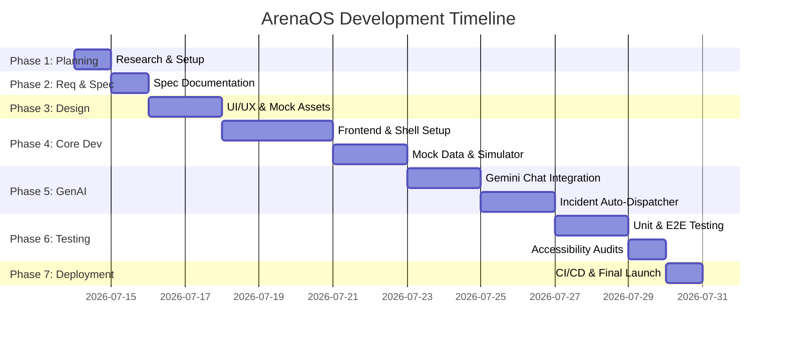

# Development Implementation Plan
## Project Name: ArenaOS — FIFA World Cup 2026 Smart Stadium & Operations Ecosystem

---

## 1. Summary of Project Phases
This document outlines the 7 phases of development required to bring ArenaOS from conception to a production-ready, fully functional web application.

---

## 2. Detailed Phase Breakdown

### Phase 1: Planning & Setup
*   **Objectives**: Establish the repository, initialize the workspace, and define tools.
*   **Tasks**:
    1.  Create the public GitHub repository with a single branch.
    2.  Set up the local directory structure.
    3.  Create initial configuration files (`package.json`, `.gitignore`, `tsconfig.json`).
*   **Deliverable**: Empty Vite project structure in the repository.

### Phase 2: Requirements Specification
*   **Objectives**: Formulate all product, technical, database, and flow requirements.
*   **Tasks**:
    1.  Compile product goals, personas, and success metrics (`prd.md`).
    2.  Define system tech stack, architectures, and GenAI pipeline (`trd.md`).
    3.  Specify frontend database state layouts and structures (`backend_schema.md`).
    4.  Outline the app navigation maps (`app_flow.md`).
*   **Deliverable**: Completed specifications folder in the project root.

### Phase 3: UI/UX & Design Layouts
*   **Objectives**: Establish the styling system, colors, and layout briefs.
*   **Tasks**:
    1.  Create styling system definitions (`ui_ux_design_brief.md`).
    2.  Define Tailwind theme configurations (emerald, gold, cyan, dark cards).
    3.  Draft static layout outlines for:
        *   Fan View (Floating AI chat + Map).
        *   Volunteer View (Task tracker + Incident reporting form).
        *   Command Center (Grid dashboard with real-time analytics graphs).
*   **Deliverable**: Draft styles in the theme file and custom base styles in `index.css`.

### Phase 4: Core Development (Frontend & Simulator)
*   **Objectives**: Program the core frontend interface screens and mock simulator logic.
*   **Tasks**:
    1.  Implement the shell layout and top view-switcher.
    2.  Code the interactive SVG stadium map showing sections, concession areas, and gates.
    3.  Create a real-time background simulator that updates:
        *   Concession/restroom queue wait-times.
        *   Gate entry flow rates.
        *   Volunteer locations.
    4.  Create dashboard graphs using charts (e.g., bar charts for gate traffic, line charts for incidents).
*   **Deliverable**: Fully navigable interactive frontend mockup with working live-sim data.

### Phase 5: GenAI Integration (Gemini SDK)
*   **Objectives**: Inject conversational AI, multi-lingual support, and automatic dispatch algorithms.
*   **Tasks**:
    1.  Integrate the `@google/generative-ai` SDK.
    2.  Write robust System Prompts for:
        *   **Fan Chat**: Translates user inputs, accesses local facility states, and outputs direction guides.
        *   **Incident Tagging**: Extract category, severity, and tags from volunteer voice-to-text / plain text.
    3.  Implement a fallback local rule-based AI processor in case of API Key absence.
    4.  Code the incident dispatch routing algorithm (finding active volunteer nearest to the incident coordinates).
*   **Deliverable**: Functional chat window, automated task dispatches, and intelligent mapping helpers.

### Phase 6: Testing & Validation
*   **Objectives**: Assure code quality, security, and accessibility constraints are met.
*   **Tasks**:
    1.  Write automated unit tests for:
        *   AI prompt formatting.
        *   Coordinate routing calculations.
        *   State updating logic.
    2.  Audit accessibility (ensure color contrast, add appropriate aria-labels, test keyboard tab index navigability).
    3.  Optimize page sizes and remove unneeded assets to guarantee size `< 10 MB`.
*   **Deliverable**: Test logs and accessibility checklist reports.

### Phase 7: Deployment & Verification
*   **Objectives**: Deploy the webapp to production and verify cloud behavior.
*   **Tasks**:
    1.  Create GitHub Actions workflow for automated Vercel/GitHub Pages deployment.
    2.  Push code to single `main` branch.
    3.  Deploy live preview, verify responsiveness on mobile devices, and confirm API key inputs.
    4.  Create comprehensive `README.md` containing the project overview, setup commands, and deployment links.
*   **Deliverable**: Live production-accessible URL, complete public repository.
