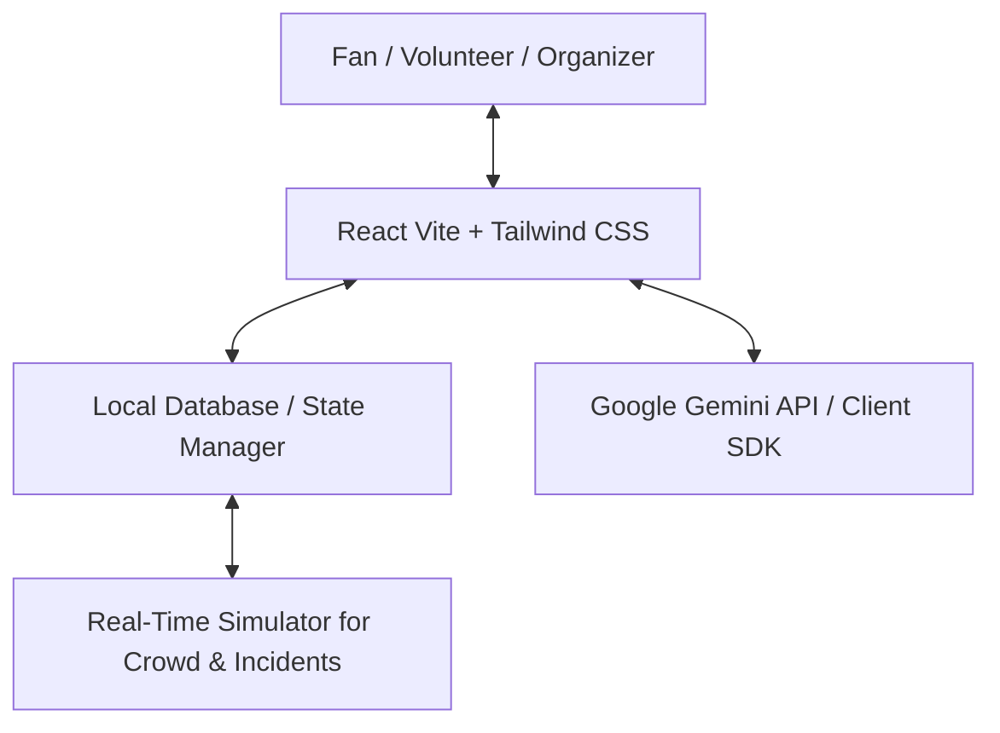

# Technical Requirement Document (TRD)
## Project Name: ArenaOS — FIFA World Cup 2026 Smart Stadium & Operations Ecosystem

---

## 1. System Architecture Overview
ArenaOS is structured as a client-side heavy single-page application (SPA) with embedded serverless/mock backend endpoints to minimize overhead and remain within the 10 MB repository constraint. It uses a component-based micro-architecture on the frontend and leverages the Google Gemini API for intelligent chat, translation, and task dispatching.

---

## 2. Technology Stack

### 2.1 Frontend (Web)
*   **Framework**: **React 18** (bootstrapped with **Vite** for fast builds and hot module reloading).
*   **Styling**: **Tailwind CSS v3** for responsive layout design. Custom vanilla CSS rules in `index.css` for background glassmorphism, glowing gradients, and animations.
*   **Iconography**: **Lucide React** for modern UI icons.
*   **Charts & Visualizations**: **Recharts** (or canvas-based custom drawing) for live crowd distribution and operations metrics.
*   **Animations**: **Framer Motion** or custom CSS keyframes for smooth, premium transitions.

### 2.2 Backend & GenAI
*   **Client-Side Integration**: The application will connect directly to the Gemini API (`@google/generative-ai` SDK) using secure client-side API configuration or simulated local GenAI processing with standard templates (if API key is omitted by user).
*   **GenAI Model**: **Gemini 1.5 Flash** (highly responsive, low-latency, and cost-effective for multi-lingual assistance and categorization tasks).
*   **Logic Engine**: A backend controller that matches incoming security/maintenance incidents to the nearest volunteers using distance algorithms (Manhattan/Euclidean grid matching).

### 2.3 Database
*   **Technology**: **In-Memory Redux-like State / LocalStorage / IndexedDB** for persistence.
*   **Simulated Backend Database**: A mock RESTful API layer that handles queries for:
    *   `Users` (Fans, Staff, Organizers)
    *   `Incidents` (Active, Pending, Resolved)
    *   `Concessions` (Wait-time metrics, stock levels)
    *   `Gates` (Flow rates, entry status)
    *   `Map Nodes` (Coordinates for indoor navigation)

### 2.4 Cloud Deployment
*   **Target**: **Vercel** or **GitHub Pages** (Single-page app configuration).
*   **CI/CD**: GitHub Actions workflow to build, test, and deploy the application automatically on push to the `main` branch.

---

## 3. Generative AI Pipeline

### 3.1 Fan Assistant Pipeline
1.  **Input**: Fan enters a message in their native language (e.g., "Où sont les toilettes?").
2.  **Processing**:
    *   Translate query to English for schema processing (if needed).
    *   Retrieve context from the current simulated venue state (e.g., queue levels at concessions and restrooms).
    *   Pass prompt to Gemini: `System: You are ArenaOS AI... Context: Restroom 3 is busy (12 min wait). Restroom 4 is empty (2 min wait). Input: Where is the restroom?`
3.  **Output**: Response in French suggesting Restroom 4 with step-by-step guidance.

### 3.2 Staff Incident Router
1.  **Input**: Volunteer types/speaks: "There is a water leak at Gate 5."
2.  **Processing**:
    *   Gemini processes the raw text to classify:
        *   `Category`: Maintenance
        *   `Severity`: Medium
        *   `Location`: Gate 5
    *   The dispatch system calculates the closest volunteer in Zone B.
3.  **Output**: Automatic task assignment sent to Volunteer's screen.

---

## 4. Key Performance & Size Constraints
*   **Bundle Size**: Minimize external dependencies. Keep third-party libraries lightweight. Use code splitting for lazy loading views (Fan vs. Staff vs. Command Center).
*   **Repo Size**: Strictly `< 10 MB`. Avoid storing heavy images or video assets. Generate UI patterns procedurally using CSS/SVG and use `generate_image` for mock profiles/creatives.
*   **Response Times**:
    *   Map rendering: `< 100ms`.
    *   Local incident updates: `< 50ms`.
    *   AI response generation: `< 2.5 seconds`.
